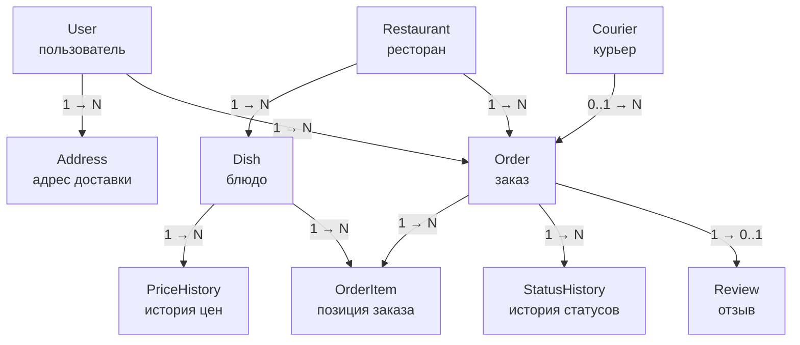
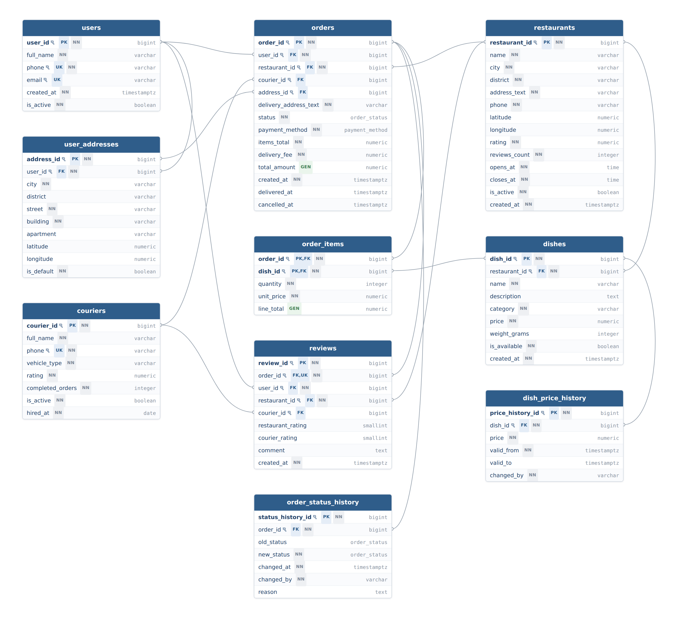

# ДЗ №1. Вариант 2: Служба доставки еды (Food Delivery)

## Соответствие бизнес-требований и модели

Каждое решение в модели выведено из конкретной фразы бизнес-домена.

| Бизнес-требование | Что из него следует |
|---|---|
| Пользователи могут просматривать рестораны, их меню, делать заказы | Сущности `users`, `restaurants`, `orders`. Регистрация в сервисах доставки идёт по телефону, отсюда `phone varchar UNIQUE NOT NULL` |
| Заказ нужно куда-то доставить | Сущность `user_addresses`. У человека несколько адресов (дом, работа), поэтому связь `users` 1:N `user_addresses`, а не поле в `users` |
| У каждого ресторана есть меню с блюдами | Сущность `dishes`, связь `restaurants` 1:N `dishes`. Одно и то же блюдо в двух ресторанах — две разные записи со своими ценами |
| В заказе может быть несколько блюд **с указанием количества** | Сущность `order_items`. Отношение между заказом и блюдом многие-ко-многим, плюс у связи есть собственный атрибут `quantity` — значит, связь должна стать сущностью |
| Курьеры доставляют заказы | Сущность `couriers`, связь `couriers` 1:N `orders`. Связь необязательная: у только что созданного заказа курьера ещё нет, поэтому `orders.courier_id` допускает `NULL` |
| Пользователи могут оставлять отзывы о ресторанах **и доставке** | Сущность `reviews` с двумя независимыми оценками: `restaurant_rating` и `courier_rating`. Отзыв привязан к заказу, а не напрямую к ресторану — так нельзя оценить ресторан, в котором ничего не заказывал |
| Продумайте, как хранить статус заказа | Атрибут `orders.status` типа `ENUM` для текущего состояния плюс сущность `order_status_history` для журнала переходов |
| Подумайте, как хранить актуальное меню при изменении цен | Атрибут `dishes.price` для действующей цены плюс сущность `dish_price_history` с интервалами `valid_from` / `valid_to` |
| Частый запрос: рестораны с рейтингом выше 4.5 **в этом районе** | Район вынесен в отдельный атрибут `restaurants.district`, а не спрятан внутри строки адреса. Рейтинг хранится готовым числом `restaurants.rating` |
| Частый запрос: курьеры, выполнившие **более 100 заказов** | Атрибут `couriers.completed_orders` — счётчик, а не пересчёт `COUNT(*)` по всем заказам при каждом обращении |

## 1. Концептуальная модель

На этом уровне указаны только сущности и связи между ними. Без атрибутов, типов данных и ключей.



### Сущности

**`User`** — зарегистрированный пользователь сервиса, он же заказчик.

**`Address`** — сохранённый адрес доставки пользователя.

**`Restaurant`** — ресторан, подключённый к сервису.

**`Dish`** — отдельное блюдо в меню ресторана.

**`PriceHistory`** — цена блюда, действовавшая в определённый период.

**`Courier`** — курьер, доставляющий заказы.

**`Order`** — заказ целиком: кто, где, что и когда заказал.

**`OrderItem`** — одна позиция внутри заказа: блюдо и его количество.

**`StatusHistory`** — запись о смене статуса заказа.

**`Review`** — отзыв о заказе с оценкой еды и оценкой доставки.

Требовалось не менее шести сущностей. Их десять: шесть обязательных, плюс `Address` — потому что заказ нужно доставлять по конкретному адресу, и `PriceHistory` со `StatusHistory` — они появились напрямую из дополнительных требований о хранении цен и статусов.

### Почему `OrderItem` — отдельная сущность

Связь «заказ ↔ блюдо» по смыслу многие-ко-многим: в заказе много блюд, а одно блюдо встречается в тысячах заказов. Реляционная модель не позволяет выразить M:N напрямую, поэтому нужна промежуточная сущность.

Но дело не только в этом. У самой связи есть собственный атрибут — количество порций. Атрибут на связи всегда означает, что связь должна стать сущностью: хранить «две порции борща» негде, кроме как в `OrderItem`.

### Почему `User` и `Courier` — разные сущности

В отличие от варианта с преподавателями и студентами, здесь роль атрибутом не обойтись. У курьера свой жизненный цикл (найм, увольнение), свой транспорт, свой рейтинг и своя статистика выполненных заказов — ни один из этих атрибутов не имеет смысла для заказчика. Общих атрибутов у них ровно два: имя и телефон. Объединять сущности ради двух совпадающих полей значило бы получить таблицу, где половина колонок всегда `NULL`.

## 2. Логическая модель

Диаграмма построена по схеме из работающей базы в нотации «воронья лапка» (Crow's Foot): одиночная черта обозначает сторону «один», раздвоенный символ — сторону «многие». `PK` — первичный ключ, `FK` — внешний, `UK` — уникальный, `NN` — `NOT NULL`, `GEN` — вычисляемый столбец.



Тот же результат можно получить на [dbdiagram.io](https://dbdiagram.io/d), вставив файл [`diagrams/food_delivery.dbml`](diagrams/food_delivery.dbml).

### Атрибуты и ключи

| Сущность | Атрибуты | PK | FK |
|---|---|---|---|
| `users` | `user_id`, `full_name`, `phone`, `email`, `created_at`, `is_active` | `user_id` | — |
| `user_addresses` | `address_id`, `user_id`, `city`, `district`, `street`, `building`, `apartment`, `latitude`, `longitude`, `is_default` | `address_id` | `user_id` на `users.user_id` |
| `restaurants` | `restaurant_id`, `name`, `city`, `district`, `address_text`, `phone`, `latitude`, `longitude`, `rating`, `reviews_count`, `opens_at`, `closes_at`, `is_active`, `created_at` | `restaurant_id` | — |
| `dishes` | `dish_id`, `restaurant_id`, `name`, `description`, `category`, `price`, `weight_grams`, `is_available`, `created_at` | `dish_id` | `restaurant_id` на `restaurants.restaurant_id` |
| `dish_price_history` | `price_history_id`, `dish_id`, `price`, `valid_from`, `valid_to`, `changed_by` | `price_history_id` | `dish_id` на `dishes.dish_id` |
| `couriers` | `courier_id`, `full_name`, `phone`, `vehicle_type`, `rating`, `completed_orders`, `is_active`, `hired_at` | `courier_id` | — |
| `orders` | `order_id`, `user_id`, `restaurant_id`, `courier_id`, `address_id`, `delivery_address_text`, `status`, `payment_method`, `items_total`, `delivery_fee`, `total_amount`, `created_at`, `delivered_at`, `cancelled_at` | `order_id` | `user_id` на `users`, `restaurant_id` на `restaurants`, `courier_id` на `couriers`, `address_id` на `user_addresses` |
| `order_items` | `order_id`, `dish_id`, `quantity`, `unit_price`, `line_total` | `(order_id, dish_id)` — составной | `order_id` на `orders`, `dish_id` на `dishes` |
| `order_status_history` | `status_history_id`, `order_id`, `old_status`, `new_status`, `changed_at`, `changed_by`, `reason` | `status_history_id` | `order_id` на `orders.order_id` |
| `reviews` | `review_id`, `order_id`, `user_id`, `restaurant_id`, `courier_id`, `restaurant_rating`, `courier_rating`, `comment`, `created_at` | `review_id` | `order_id` на `orders`, `user_id` на `users`, `restaurant_id` на `restaurants`, `courier_id` на `couriers` |

Первичные ключи везде суррогатные. У пользователя есть естественный ключ — телефон, но телефон меняют, и тогда пришлось бы каскадно обновлять его во всех заказах. Поэтому телефон объявлен `UNIQUE` как альтернативный ключ, а первичным сделан неизменяемый номер.

### Кардинальность связей

| Связь | Тип | Чтение |
|---|---|---|
| `users` — `user_addresses` | 1:N | У одного пользователя много адресов, каждый адрес принадлежит одному пользователю |
| `users` — `orders` | 1:N | Один пользователь делает много заказов, каждый заказ принадлежит одному пользователю |
| `users` — `reviews` | 1:N | Один пользователь пишет много отзывов, каждый отзыв написан одним пользователем |
| `restaurants` — `dishes` | 1:N | В одном меню много блюд, каждое блюдо принадлежит одному ресторану |
| `restaurants` — `orders` | 1:N | Ресторан принимает много заказов, каждый заказ оформлен в одном ресторане |
| `restaurants` — `reviews` | 1:N | У одного ресторана много отзывов, каждый отзыв относится к одному ресторану |
| `dishes` — `dish_price_history` | 1:N | У блюда много записей в истории цен, каждая запись относится к одному блюду |
| `dishes` — `order_items` | 1:N | Блюдо входит во много заказов, каждая позиция ссылается на одно блюдо |
| `couriers` — `orders` | 0..1:N | Курьер везёт много заказов, но у нового заказа курьера ещё нет |
| `orders` — `order_items` | 1:1..N | В заказе минимум одна позиция, каждая позиция принадлежит одному заказу |
| `orders` — `order_status_history` | 1:N | Заказ проходит много переходов, каждая запись журнала относится к одному заказу |
| `orders` — `reviews` | 1:0..1 | На заказ можно оставить не более одного отзыва |
| `user_addresses` — `orders` | 0..1:N | На один адрес много заказов, но адрес в заказе необязателен |

Исходное отношение `orders` — `dishes` имеет тип M:N. На логическом уровне оно разложено на пару связей 1:N через `order_items`, поскольку реляционная модель не позволяет выразить M:N напрямую.

### Идентифицирующие и неидентифицирующие связи

Связь идентифицирующая, если внешний ключ входит в первичный ключ дочерней сущности. Если у дочерней сущности собственный независимый первичный ключ, связь неидентифицирующая.

Идентифицирующая связь в модели ровно одна — `orders` — `order_items`. Первичный ключ позиции составной, `(order_id, dish_id)`, и ссылка на заказ входит в него. «Позиция заказа №5» вне заказа №5 не существует и не может быть опознана.

Выбор осознанный. Составной ключ не просто идентифицирует строку, он ещё и выражает бизнес-правило: одно блюдо встречается в заказе один раз, а кратность задаётся полем `quantity`, а не повторением строк. Добавить в заказ «борщ» дважды физически невозможно.

Остальные двенадцать связей неидентифицирующие: у дочерних сущностей собственные суррогатные ключи. Раз формальный признак почти везде одинаковый, реальная разница между связями проходит по правилу удаления родителя:

| Правило | Где применено | Смысл |
|---|---|---|
| `ON DELETE CASCADE` | адреса, блюда, история цен, журнал статусов, отзывы | Без родителя эти данные бессмысленны и удаляются вместе с ним |
| `ON DELETE RESTRICT` | заказы, позиции заказов | Заказ — финансовый документ. Удалить пользователя, у которого есть заказы, или блюдо, которое хоть раз заказывали, нельзя |
| `ON DELETE SET NULL` | курьер и адрес в заказе | Связь изначально необязательная. Курьер уволился — заказ остаётся, ссылка обнуляется |

## 3. Физическая модель

Полный скрипт: [`sql/01_schema.sql`](sql/01_schema.sql).

### Выбор типов данных

| Тип | Где применён | Обоснование |
|---|---|---|
| `bigint` + `GENERATED ALWAYS AS IDENTITY` | все первичные ключи | Современный аналог `SERIAL`. Запрещает вставить `id` вручную и сломать нумерацию. `bigint`, а не `integer`: у таблицы заказов сервиса доставки потолок в 2.1 млрд строк достижим, а миграция типа первичного ключа на живой таблице переписывает её целиком |
| `numeric(10,2)` | `price`, `unit_price`, `items_total`, `delivery_fee`, `total_amount` | Денежные суммы требуют точной десятичной арифметики. В `real`/`double precision` деньги хранить нельзя: там `0.1 + 0.2 ≠ 0.3`. Встроенный тип `money` тоже не подходит — его точность зависит от настройки `lc_monetary` |
| `numeric(2,1)` | `rating` у ресторана и курьера | Диапазон 0.0–5.0 с одним знаком после запятой — ровно то, что показывается в интерфейсе |
| `smallint` | `restaurant_rating`, `courier_rating` | Значения от 1 до 5. `integer` здесь занял бы вдвое больше без единой причины |
| `varchar` | `full_name`, `phone`, `name`, `category`, `vehicle_type` | Короткие строки ограниченной длины. Ограничение длины само по себе защищает от мусора |
| `text` | `description`, `comment`, `reason` | Длина заранее неизвестна. В PostgreSQL `text` и `varchar` хранятся одинаково |
| `timestamptz` | `created_at`, `delivered_at`, `cancelled_at`, `valid_from`, `valid_to` | Время с часовым поясом. Доставка работает в разных городах, и `timestamp` без зоны стал бы источником ошибок при переходе на летнее время |
| `time` | `opens_at`, `closes_at` | Часы работы ресторана — это время суток, а не момент |
| `date` | `hired_at` | Час найма курьера не нужен |
| `boolean` | `is_active`, `is_available`, `is_default` | Флаг — это флаг, а не `integer` со значениями 0 и 1 |
| `ENUM` | `status`, `payment_method` | Домен фиксирован бизнес-процессом, занимает 4 байта, проверка значения встроена в сам тип |

### Ограничения целостности

**`PRIMARY KEY`** — во всех десяти таблицах. В `order_items` он составной, `(order_id, dish_id)`.

**`FOREIGN KEY`** — четырнадцать штук, по числу связей, каждый с явно указанной политикой `ON DELETE` (см. таблицу в разделе 2). Они гарантируют, что нельзя оформить заказ в несуществующем ресторане или добавить в заказ несуществующее блюдо.

**`NOT NULL`** — на всех атрибутах, обязательных по бизнес-логике. Ключевое исключение — `orders.courier_id`: он намеренно допускает `NULL`, потому что в момент создания заказа курьер ещё не назначен. Так необязательность связи выражается прямо в схеме.

**`UNIQUE`** — на `users.phone` и `couriers.phone` (телефон — фактический бизнес-ключ), на паре `(restaurant_id, name)` в `dishes` (два одинаковых блюда в одном меню запрещены) и на `reviews.order_id` (один заказ — один отзыв; именно это ограничение реализует кардинальность 1:0..1).

**`CHECK`** — на бизнес-правилах: `price > 0`, `quantity > 0`, `rating BETWEEN 1 AND 5`, формат телефона по регулярному выражению. Отдельно стоит межколоночный `CHECK`:

```sql
CHECK ((status = 'delivered') = (delivered_at IS NOT NULL))
```

Он не даёт статусу и отметке времени противоречить друг другу: заказ считается доставленным тогда и только тогда, когда у него есть время доставки.

**Частичные уникальные индексы** — там, где обычный `UNIQUE` бессилен. Правило «у пользователя ровно один адрес по умолчанию» через `UNIQUE (user_id, is_default)` не выразить: такое ограничение запретило бы и два обычных адреса тоже. Нужен именно частичный индекс:

```sql
CREATE UNIQUE INDEX uq_user_addresses_one_default
    ON user_addresses (user_id) WHERE is_default;
```

**`GENERATED ... STORED`** — `orders.total_amount` и `order_items.line_total` вычисляет сама база. Итог не может разойтись с составляющими, потому что отдельно он не хранится.

### Индексы

PostgreSQL, в отличие от MySQL, не создаёт индексы под внешние ключи автоматически. Без них соединение по внешнему ключу идёт через полное сканирование таблицы. На каждый внешний ключ создан индекс:

```sql
CREATE INDEX idx_user_addresses_user_id      ON user_addresses (user_id);
CREATE INDEX idx_dishes_restaurant_id        ON dishes (restaurant_id);
CREATE INDEX idx_dish_price_history_dish_id  ON dish_price_history (dish_id);
CREATE INDEX idx_orders_user_id              ON orders (user_id);
CREATE INDEX idx_orders_restaurant_id        ON orders (restaurant_id);
CREATE INDEX idx_orders_courier_id           ON orders (courier_id);
CREATE INDEX idx_orders_address_id           ON orders (address_id);
CREATE INDEX idx_order_items_dish_id         ON order_items (dish_id);
CREATE INDEX idx_order_status_history_order  ON order_status_history (order_id, changed_at);
CREATE INDEX idx_reviews_user_id             ON reviews (user_id);
CREATE INDEX idx_reviews_restaurant_id       ON reviews (restaurant_id);
CREATE INDEX idx_reviews_courier_id          ON reviews (courier_id);
```

Исключение одно: `order_items.order_id` отдельного индекса не получает, потому что он уже является первым столбцом составного первичного ключа и поиск по нему покрыт индексом `PRIMARY KEY`. А `dish_id` — второй столбец, префиксом он не является, поэтому индексируется отдельно.

Ещё пять индексов построены под частые запросы из раздела 4. Два из них стоит показать:

```sql
CREATE INDEX idx_restaurants_district_rating
    ON restaurants (city, district, rating DESC) WHERE is_active;

CREATE INDEX idx_orders_restaurant_revenue
    ON orders (restaurant_id, created_at)
    INCLUDE (total_amount) WHERE status = 'delivered';
```

Первый частичный: закрытые рестораны в витрину не попадают никогда, поэтому в индексе их можно вообще не хранить. Второй покрывающий: благодаря `INCLUDE` выручку можно посчитать, не обращаясь к самой таблице — `EXPLAIN` подтверждает выбор `Index Only Scan`.

### Хранение статуса заказа

Требование «продумайте, как хранить статус заказа» закрыто на двух уровнях, потому что они решают разные задачи.

Текущий статус лежит в `orders.status` типа `ENUM`. Он читается при каждом обновлении экрана заказа и должен быть максимально дешёвым: одно поле в той же строке, без соединений.

Полная история переходов — в `order_status_history`: `old_status`, `new_status`, `changed_at`, `changed_by`, `reason`. Она отвечает на вопросы, на которые одно поле ответить не может: сколько заказ простоял на кухне, кто и почему его отменил, на каком этапе чаще всего теряется время.

`ENUM` выбран вместо справочной таблицы, потому что список статусов фиксирован бизнес-процессом и меняется раз в несколько лет, а справочник потребовал бы соединения при каждом показе заказа. Если бы понадобились локализованные названия статусов или их порядок для интерфейса, правильным выбором была бы таблица-справочник.

### История цен меню

Требование «изменение цен со временем» простым `UPDATE dishes SET price = ...` не закрывается: старая цена теряется безвозвратно, и отчёт о выручке за прошлый месяц перестаёт сходиться.

Применено интервальное версионирование. Действующая цена лежит в `dishes.price` и читается витриной меню напрямую. Вся история — в `dish_price_history` с полями `valid_from` и `valid_to`, где строка с `valid_to IS NULL` соответствует текущей цене. Частичный уникальный индекс `(dish_id) WHERE valid_to IS NULL` гарантирует, что действующая цена ровно одна, а `CHECK (valid_to IS NULL OR valid_to > valid_from)` не даёт создать интервал отрицательной длины.

Отдельно стоит цена в позиции заказа. Даже при наличии истории `order_items.unit_price` хранит снимок — сумму, которую клиент реально заплатил. Если бы цена бралась соединением с `dishes`, то после подорожания блюда исторические чеки изменились бы задним числом. По той же причине в `orders.delivery_address_text` сохраняется снимок адреса: пользователь может удалить адрес из справочника, но в истории заказа должно остаться то, куда реально везли.

Изменение состава меню решается флагом `dishes.is_available`, а не удалением строки: на блюдо ссылаются позиции прошлых заказов, и `ON DELETE RESTRICT` физически не даёт удалить когда-либо заказанное блюдо.

### Воспроизводимость

Скрипт начинается с трёх строк:

```sql
DROP SCHEMA IF EXISTS food_delivery CASCADE;
CREATE SCHEMA food_delivery;
SET search_path = food_delivery, public;
```

`IF EXISTS` позволяет отработать первому запуску, когда схемы ещё нет. `CASCADE` удаляет схему вместе со всем содержимым, включая перечислимые типы. Работа в отдельной схеме изолирует модель от остальных объектов базы, поэтому повторный прогон всегда даёт одинаковый результат и ничего постороннего не затрагивает.

## 4. Частые запросы

Пять наиболее частых обращений к базе, сформулированных словами.

**1. Какие рестораны работают в этом районе и имеют рейтинг выше 4.5?**

Витрина каталога, открывается при каждом заходе в приложение. Обслуживается частичным индексом по городу, району и рейтингу.

**2. Какие десять блюд заказывали чаще всего за последнюю неделю?**

Популярность считается как сумма `order_items.quantity`, а не как число строк: две порции в одном заказе — это два заказанных блюда.

**3. Что входит в конкретный заказ: пользователь, ресторан, список блюд с ценами, курьер?**

Экран деталей заказа. Цены берутся из снимка в позициях, а не из текущего меню.

**4. Какую выручку принёс каждый ресторан за текущий месяц?**

Считаются только заказы со статусом `delivered` — отменённые в выручку не попадают. Обслуживается покрывающим индексом.

**5. Какие курьеры выполнили более 100 заказов и имеют высокий рейтинг?**

Используется счётчик `couriers.completed_orders`, а не пересчёт по таблице заказов — она самая большая в базе.

Три атрибута в модели денормализованы ради этих запросов: `restaurants.rating`, `restaurants.reviews_count` и `couriers.completed_orders`. Плата за это — необходимость поддерживать их в актуальном состоянии триггером или по расписанию. В сервисе доставки читают на несколько порядков чаще, чем пишут, поэтому компромисс оправдан.

## Что было сделано

Разобран бизнес-домен сервиса доставки еды, из него выделены десять сущностей и связи между ними. Модель последовательно проведена через три уровня: концептуальный (сущности и связи), логический (атрибуты, ключи, кардинальность, разбор идентифицирующих связей) и физический (SQL-скрипт для PostgreSQL с типами данных, ограничениями целостности и индексами на внешние ключи).

Отдельно закрыты оба дополнительных требования варианта: хранение статуса заказа решено парой «поле `ENUM` плюс журнал переходов», хранение меню при изменении цен — интервальным версионированием.

Скрипт воспроизводим, работает в изолированной схеме и корректно отрабатывает при повторном запуске. Проверено на PostgreSQL 16.13: создаётся 10 таблиц и 36 индексов, срабатывание восьми ограничений подтверждено, использование индексов подтверждено планом `EXPLAIN`.
